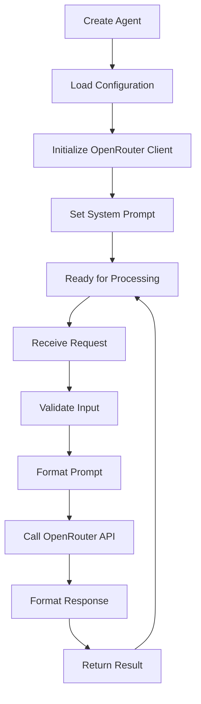

# 🤖 OpenRouter Agents

[](https://www.npmjs.com/package/openrouter-agents)
[](https://www.npmjs.com/package/openrouter-agents)
[](https://github.com/bramato/openrouter-agents/blob/master/LICENSE)
[](https://www.typescriptlang.org/)
[](https://nodejs.org/)

> **Intelligent AI Agents for Every Development Task**

Transform your development workflow with specialized AI agents powered by OpenRouter's extensive model ecosystem. From mock data generation to code documentation, OpenRouter Agents provides ready-to-use AI solutions for your most common development tasks.

```
    ╭─────────────────────────────────────╮
    │  🚀 OpenRouter Agents Platform      │
    │                                     │
    │  ┌─┐┌─┐┌─┐┌─┐┌┐┌┬─┐┌─┐┬ ┬┌┬┐┌─┐┬─┐ │
    │  │ │├─┘├┤ │││├┴┐├┬┘│ ││ │ │ ├┤ ├┬┘ │
    │  └─┘┴  └─┘┘└┘┴ ┴┴└─└─┘└─┘ ┴ └─┘┴└─ │
    │                                     │
    │  🤖 AI Agents for Every Task        │
    ╰─────────────────────────────────────╯
```

## ✨ Features

- 🎯 **Specialized Agents**: Ready-to-use agents for common development tasks
- 🔗 **OpenRouter Integration**: Access to 100+ AI models through OpenRouter API
- 💻 **Beautiful CLI**: Intuitive command-line interface with ASCII art and colors
- ⚡ **TypeScript First**: Full TypeScript support with comprehensive type definitions
- 📊 **Performance Benchmarking**: Built-in testing and performance analysis
- 🔧 **Highly Configurable**: Flexible configuration system for all your needs
- 📦 **Zero Lock-in**: Use as CLI, library, or integrate into existing projects

## 🚀 Quick Start

### Installation

```bash
# Install globally for CLI usage
npm install -g openrouter-agents

# Or install locally for project integration
npm install openrouter-agents
```

### Setup

1. Get your OpenRouter API key from [OpenRouter.ai](https://openrouter.ai)
2. Configure the package:

```bash
openrouter-agents config --set-key YOUR_API_KEY
```

### Create Your First Agent

```bash
# Interactive agent creation
openrouter-agents create --interactive

# Quick agent creation
openrouter-agents create mock-data --name "data-generator"
```

### Start Chatting

```bash
openrouter-agents chat data-generator
```

## 🎯 Agent Types

### 📋 Mock Data Generator
Generate realistic test data for your applications.

```bash
openrouter-agents create mock-data
```

**Perfect for:**
- API testing and development
- Database seeding
- Frontend prototyping
- Load testing scenarios

**Example Usage:**
```bash
# Create mock data agent
openrouter-agents create mock-data --name "api-mocker"

# Generate user data
openrouter-agents chat api-mocker
> Generate 10 users with realistic data including name, email, address
```

### 💻 Code Generator  
Create clean, well-structured code following best practices.

```bash
openrouter-agents create code-generator
```

**Perfect for:**
- Boilerplate code generation
- API endpoint creation
- Component scaffolding
- Utility function creation

**Example Usage:**
```bash
# Create code generator
openrouter-agents create code-generator --name "react-helper"

# Generate React component
openrouter-agents chat react-helper
> Create a responsive navbar component with TypeScript and Tailwind CSS
```

### 🌐 Translator
Accurate translations while preserving technical context.

```bash
openrouter-agents create translator
```

**Perfect for:**
- Documentation translation
- UI/UX copy localization
- Technical content translation
- Multi-language support

### 📚 Documentation
Create comprehensive documentation and guides.

```bash
openrouter-agents create documentation
```

**Perfect for:**
- API documentation
- README files
- Code comments
- User guides

### 🔧 Custom Agents
Build specialized agents for your unique use cases.

```bash
openrouter-agents create custom --name "my-specialist"
```

## 📖 CLI Reference

### Global Commands

```bash
openrouter-agents --version     # Show version
openrouter-agents --help        # Show help
```

### Agent Management

#### `create` - Create New Agents
```bash
# Interactive mode (recommended)
openrouter-agents create --interactive

# Quick creation
openrouter-agents create <type> [options]

Options:
  -n, --name <name>           Agent name
  -m, --model <model>         OpenRouter model
  -t, --temperature <temp>    Temperature (0.0-1.0)
  --max-tokens <tokens>       Maximum tokens
  --interactive               Interactive mode
```

#### `list` - Browse Agents & Models
```bash
# List your agents
openrouter-agents list --agents

# List available OpenRouter models
openrouter-agents list --models

# Show models with JSON support only
openrouter-agents list --models --json-only

# Export as JSON
openrouter-agents list --models --export models.json
```

#### `config` - Configuration Management
```bash
# Set API key
openrouter-agents config --set-key YOUR_API_KEY

# View configuration
openrouter-agents config --show

# Set default model
openrouter-agents config --set-model anthropic/claude-3.5-sonnet

# Reset configuration
openrouter-agents config --reset
```

### Interaction

#### `chat` - Interactive Chat
```bash
# Chat with specific agent
openrouter-agents chat <agent-name>

# Chat with model selection
openrouter-agents chat <agent-name> --model gpt-4

# Save conversation
openrouter-agents chat <agent-name> --save conversation.json

Options:
  -m, --model <model>         Override agent model
  -t, --temperature <temp>    Override temperature
  --max-tokens <tokens>       Override max tokens
  --save <file>               Save conversation
```

#### `test` - Testing & Benchmarks
```bash
# Test specific agent
openrouter-agents test <agent-name>

# Run benchmark suite
openrouter-agents test --benchmark

# Test with custom cases
openrouter-agents test <agent-name> --cases test-cases.json

# Performance comparison
openrouter-agents test --compare --models claude,gpt-4

Options:
  --benchmark                 Run performance benchmarks
  --cases <file>              Custom test cases
  --iterations <n>            Number of iterations
  --compare                   Compare multiple models
  --models <models>           Models to compare (comma-separated)
  --export <file>             Export results
```

## 🔧 Programmatic Usage

### Basic Agent Usage

```typescript
import { AgentManager, OpenRouterClient } from 'openrouter-agents';

// Initialize agent manager
const manager = new AgentManager({
  openRouter: {
    apiKey: 'your-api-key',
    baseURL: 'https://openrouter.ai/api/v1'
  }
});

// Create and use an agent
const mockAgent = manager.createAgent({
  name: 'data-generator',
  type: 'mock-data',
  model: 'anthropic/claude-3.5-sonnet',
  temperature: 0.7
});

// Generate mock data
const response = await mockAgent.process({
  input: 'Generate 5 realistic user profiles',
  options: { forceJson: true }
});

console.log(response.data);
```

### Advanced Configuration

```typescript
import { Agent, AgentConfig } from 'openrouter-agents';

const config: AgentConfig = {
  name: 'advanced-coder',
  type: 'code-generator',
  description: 'Advanced code generation with best practices',
  openRouter: {
    apiKey: process.env.OPENROUTER_API_KEY!,
    model: 'anthropic/claude-3.5-sonnet',
    baseURL: 'https://openrouter.ai/api/v1'
  },
  temperature: 0.3,
  maxTokens: 4000,
  systemPrompt: `You are an expert software engineer...`,
  features: {
    jsonMode: false,
    batchProcessing: true,
    sessionMemory: true,
    schemaValidation: true
  }
};

// Custom agent implementation
class CustomCodeAgent extends Agent {
  getType() { return 'code-generator' as const; }
  
  getCapabilities() {
    return {
      jsonMode: false,
      imageGeneration: false,
      batchProcessing: true,
      streamingSupport: true,
      contextMemory: true,
      schemaValidation: false
    };
  }
  
  getSystemPrompt() {
    return this.config.systemPrompt || 'Generate clean code';
  }
  
  protected validateInput(input: any): boolean {
    return typeof input === 'string' && input.length > 0;
  }
  
  protected formatOutput(output: any): any {
    return output.trim();
  }
}
```

### Batch Processing

```typescript
const testCases = [
  'Generate user model',
  'Create API endpoint for users',
  'Add validation middleware'
];

const results = await Promise.all(
  testCases.map(testCase => 
    codeAgent.process({ input: testCase })
  )
);

results.forEach((result, index) => {
  console.log(`Test ${index + 1}:`, result.data);
});
```

## 🎨 CLI Screenshots

### Agent Creation Wizard
```
╔══════════════════════════════════════════════════╗
║                                                  ║
║  🤖 AGENT CREATOR                                ║
║                                      v1.0.0     ║
║                                                  ║
║  Create intelligent AI agents for specific       ║
║  tasks                                           ║
║                                                  ║
╚══════════════════════════════════════════════════╝

? What type of agent would you like to create?
  🎯 Mock Data Generator - Generate realistic test data
❯ 💻 Code Generator - Generate clean, structured code
  🌐 Translator - Accurate text translation
  📚 Documentation - Create comprehensive docs
  🔧 Custom Agent - Build your own specialized agent
```

### Model Selection
```
┌─────────────────────┬────────────────┬─────────────┬───────────────┐
│ Model               │ Provider       │ JSON Mode   │ Cost/1M Tokens│
├─────────────────────┼────────────────┼─────────────┼───────────────┤
│ claude-3.5-sonnet   │ Anthropic      │ ✅          │ $3.00         │
│ gpt-4.1-nano        │ OpenAI         │ ✅          │ $30.00        │
│ llama-3.1-8b        │ Meta           │ ✅          │ Free          │
│ claude-3-haiku      │ Anthropic      │ ✅          │ $0.50         │
└─────────────────────┴────────────────┴─────────────┴───────────────┘
```

### Chat Interface
```
╭─────────────────────────────────────╮
│  💬 Chat with data-generator        │
│  Model: anthropic/claude-3.5-sonnet │
│  Type: mock-data                    │
╰─────────────────────────────────────╯

You: Generate 3 realistic users with profile data

🤖 data-generator: Here's realistic user data:

{
  "users": [
    {
      "id": 1,
      "name": "Sarah Johnson",
      "email": "sarah.johnson@email.com",
      "avatar": "https://picsum.photos/seed/sarah/150/150",
      "age": 28,
      "location": "Seattle, WA"
    }
    // ... more users
  ]
}

───────────────────────────────────────
📊 Response time: 1.2s | Tokens: 245
```

## 🏗️ Architecture

### Core Components

```
openrouter-agents/
├── src/
│   ├── core/              # Core agent system
│   │   ├── Agent.ts       # Base agent class
│   │   ├── AgentManager.ts # Agent lifecycle management
│   │   ├── OpenRouterAPI.ts # OpenRouter API client
│   │   └── OpenRouterClient.ts # HTTP client wrapper
│   ├── types/             # TypeScript definitions
│   │   ├── agent.ts       # Agent interfaces
│   │   ├── api.ts         # API types
│   │   └── config.ts      # Configuration types
│   ├── cli/               # Command line interface
│   │   ├── commands/      # CLI commands
│   │   └── utils/         # CLI utilities
│   └── utils/             # Shared utilities
```

### Agent Lifecycle



## 🔧 Configuration

### Environment Variables
```bash
# Required
OPENROUTER_API_KEY=your_api_key_here

# Optional
OPENROUTER_BASE_URL=https://openrouter.ai/api/v1
DEFAULT_MODEL=anthropic/claude-3.5-sonnet
DEFAULT_TEMPERATURE=0.7
DEFAULT_MAX_TOKENS=4000
```

### Configuration File
Location: `~/.openrouter-agents/config.yaml`

```yaml
apiKey: your_api_key
baseURL: https://openrouter.ai/api/v1
defaultModel: anthropic/claude-3.5-sonnet
preferences:
  temperature: 0.7
  maxTokens: 4000
  jsonMode: true
agents:
  - name: my-data-generator
    type: mock-data
    model: anthropic/claude-3.5-sonnet
    temperature: 0.7
```

## 🧪 Testing

### Running Tests

```bash
# Run all tests
npm test

# Watch mode
npm run test:watch

# Coverage report
npm run test:coverage

# Integration tests only
npm run test:integration
```

### Custom Test Cases

Create `test-cases.json`:
```json
{
  "mock-data": [
    {
      "input": "Generate 5 users",
      "expected": "array with 5 user objects"
    }
  ],
  "code-generator": [
    {
      "input": "Create React component",
      "expected": "valid React component code"
    }
  ]
}
```

Run with custom cases:
```bash
openrouter-agents test --cases test-cases.json
```

## 🤝 Contributing

We welcome contributions! Here's how to get started:

### Development Setup

```bash
# Clone repository
git clone https://github.com/bramato/openrouter-agents.git
cd openrouter-agents

# Install dependencies
npm install

# Start development mode
npm run dev

# Run tests
npm test
```

### Contribution Guidelines

1. **Fork** the repository
2. **Create** a feature branch: `git checkout -b feature/amazing-feature`
3. **Commit** changes: `git commit -m 'Add amazing feature'`
4. **Push** to branch: `git push origin feature/amazing-feature`
5. **Open** a Pull Request

### Adding New Agent Types

1. Create agent type in `src/types/config.ts`
2. Implement agent class extending `Agent`
3. Add CLI command support
4. Add tests and documentation
5. Update README examples

### Code Standards

- **TypeScript**: Full type safety required
- **ESLint**: Follow existing linting rules
- **Testing**: Maintain 80%+ code coverage
- **Documentation**: Update README for new features

## 📚 Examples

### Mock Data Generation
```typescript
// Generate e-commerce product data
const products = await mockAgent.process({
  input: {
    type: 'products',
    count: 10,
    schema: {
      name: 'string',
      price: 'number',
      category: 'electronics|clothing|books',
      inStock: 'boolean',
      image: 'url'
    }
  },
  options: { forceJson: true }
});
```

### Code Generation
```typescript
// Generate API endpoint
const endpoint = await codeAgent.process({
  input: `
    Create a REST API endpoint for user management:
    - GET /users - list users
    - POST /users - create user
    - Use Express.js and TypeScript
    - Include validation middleware
  `
});
```

### Translation
```typescript
// Translate documentation
const translated = await translatorAgent.process({
  input: {
    text: 'This API endpoint creates a new user account',
    from: 'en',
    to: 'es',
    context: 'technical documentation'
  }
});
```

## 🔗 Links

- 📦 **NPM Package**: [openrouter-agents](https://www.npmjs.com/package/openrouter-agents)
- 🐙 **GitHub Repository**: [bramato/openrouter-agents](https://github.com/bramato/openrouter-agents)
- 🤖 **OpenRouter Platform**: [openrouter.ai](https://openrouter.ai)
- 📖 **Documentation**: [GitHub Wiki](https://github.com/bramato/openrouter-agents/wiki)
- 🐛 **Report Issues**: [GitHub Issues](https://github.com/bramato/openrouter-agents/issues)
- 💬 **Discussions**: [GitHub Discussions](https://github.com/bramato/openrouter-agents/discussions)

## 📄 License

This project is licensed under the MIT License - see the [LICENSE](LICENSE) file for details.

## 👨‍💻 Author

**Marco Bramato**
- Website: [marco.bramato.com](https://marco.bramato.com)
- Email: [marco@bramato.com](mailto:marco@bramato.com)
- GitHub: [@bramato](https://github.com/bramato)

---

<div align="center">

**Made with ❤️ for the developer community**

[⭐ Star on GitHub](https://github.com/bramato/openrouter-agents) • [📖 Documentation](https://github.com/bramato/openrouter-agents/wiki) • [🐛 Report Bug](https://github.com/bramato/openrouter-agents/issues)

</div>